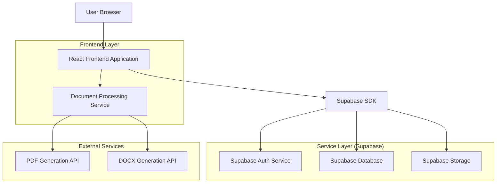
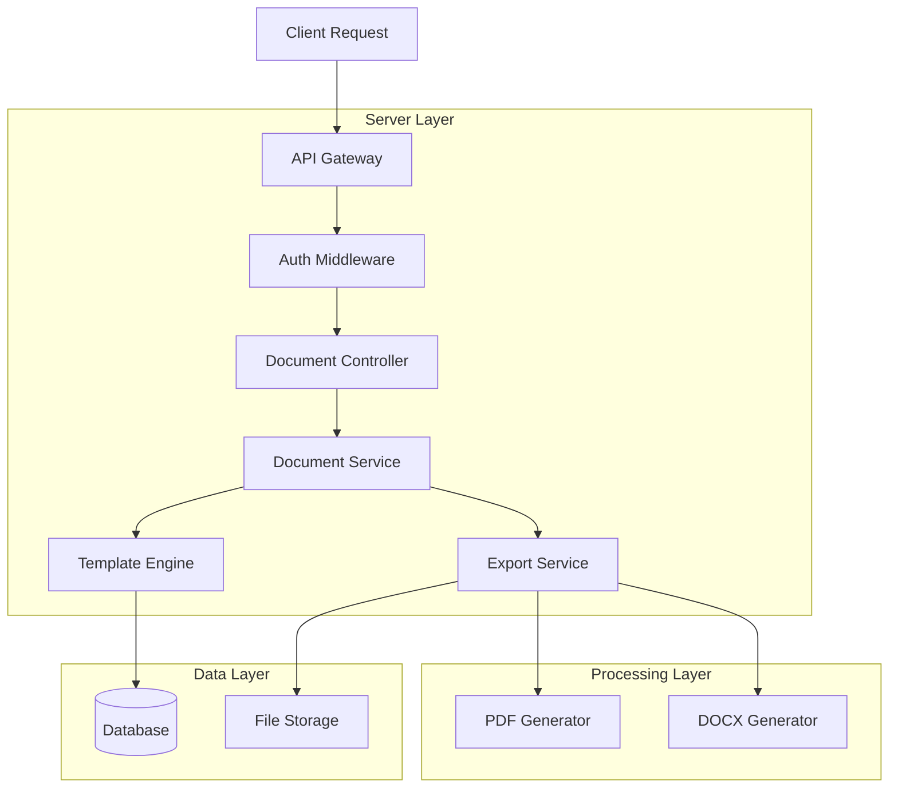
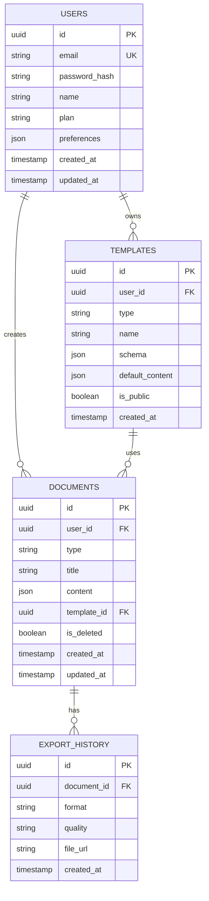

## 1. Architecture Design



## 2. Technology Description
- **Frontend**: React@18 + TypeScript + TailwindCSS@3 + Vite
- **Initialization Tool**: vite-init
- **Backend**: Supabase (PostgreSQL, Auth, Storage)
- **Document Processing**: Puppeteer (PDF), docx@8 (DOCX), html2canvas (Image)
- **State Management**: React Context + Zustand
- **UI Components**: HeadlessUI + Heroicons
- **Form Validation**: React Hook Form + Zod
- **Accessibility**: React Aria + Radix UI

## 3. Route Definitions
| Route | Purpose |
|-------|---------|
| / | Registry Dashboard - Document generator selection |
| /generator/:type | Generator Interface - Document creation form and preview |
| /history | Document History - Saved documents management |
| /profile | User Profile - Account settings and preferences |
| /auth/login | Login Page - User authentication |
| /auth/register | Registration Page - New user signup |
| /auth/reset-password | Password Reset - Account recovery |

## 4. API Definitions

### 4.1 Document Management APIs

**Create Document**
```
POST /api/documents
```

Request:
| Param Name | Param Type | isRequired | Description |
|------------|------------|------------|-------------|
| type | string | true | Document type (resume, invoice, contract, report, certificate, letter) |
| title | string | true | Document title |
| content | object | true | Document content data |
| template_id | string | false | Template identifier |

Response:
| Param Name | Param Type | Description |
|------------|------------|-------------|
| id | string | Document unique identifier |
| status | string | Document creation status |
| download_url | string | Temporary download URL |

### 4.2 Export APIs

**Export Document**
```
POST /api/documents/:id/export
```

Request:
| Param Name | Param Type | isRequired | Description |
|------------|------------|------------|-------------|
| format | string | true | Export format (pdf, docx, html, markdown) |
| quality | string | false | Export quality (high, medium, low) |
| watermark | boolean | false | Include watermark for guest users |

### 4.3 Template APIs

**Get Document Templates**
```
GET /api/templates/:type
```

Response:
| Param Name | Param Type | Description |
|------------|------------|-------------|
| templates | array | Available templates for document type |
| fields | object | Form field definitions and validation rules |

## 5. Server Architecture Diagram



## 6. Data Model

### 6.1 Data Model Definition



### 6.2 Data Definition Language

**Users Table**
```sql
-- Create users table
CREATE TABLE users (
    id UUID PRIMARY KEY DEFAULT gen_random_uuid(),
    email VARCHAR(255) UNIQUE NOT NULL,
    password_hash VARCHAR(255) NOT NULL,
    name VARCHAR(100) NOT NULL,
    plan VARCHAR(20) DEFAULT 'free' CHECK (plan IN ('free', 'premium')),
    preferences JSONB DEFAULT '{}',
    created_at TIMESTAMP WITH TIME ZONE DEFAULT NOW(),
    updated_at TIMESTAMP WITH TIME ZONE DEFAULT NOW()
);

-- Create index
CREATE INDEX idx_users_email ON users(email);
CREATE INDEX idx_users_plan ON users(plan);
```

**Documents Table**
```sql
-- Create documents table
CREATE TABLE documents (
    id UUID PRIMARY KEY DEFAULT gen_random_uuid(),
    user_id UUID REFERENCES users(id) ON DELETE CASCADE,
    type VARCHAR(50) NOT NULL CHECK (type IN ('resume', 'invoice', 'contract', 'report', 'certificate', 'letter')),
    title VARCHAR(255) NOT NULL,
    content JSONB NOT NULL,
    template_id UUID REFERENCES templates(id),
    is_deleted BOOLEAN DEFAULT FALSE,
    created_at TIMESTAMP WITH TIME ZONE DEFAULT NOW(),
    updated_at TIMESTAMP WITH TIME ZONE DEFAULT NOW()
);

-- Create indexes
CREATE INDEX idx_documents_user_id ON documents(user_id);
CREATE INDEX idx_documents_type ON documents(type);
CREATE INDEX idx_documents_created_at ON documents(created_at DESC);
CREATE INDEX idx_documents_user_type ON documents(user_id, type);
```

**Templates Table**
```sql
-- Create templates table
CREATE TABLE templates (
    id UUID PRIMARY KEY DEFAULT gen_random_uuid(),
    user_id UUID REFERENCES users(id) ON DELETE CASCADE,
    type VARCHAR(50) NOT NULL CHECK (type IN ('resume', 'invoice', 'contract', 'report', 'certificate', 'letter')),
    name VARCHAR(255) NOT NULL,
    schema JSONB NOT NULL,
    default_content JSONB DEFAULT '{}',
    is_public BOOLEAN DEFAULT FALSE,
    created_at TIMESTAMP WITH TIME ZONE DEFAULT NOW()
);

-- Create indexes
CREATE INDEX idx_templates_user_id ON templates(user_id);
CREATE INDEX idx_templates_type ON templates(type);
CREATE INDEX idx_templates_public ON templates(is_public) WHERE is_public = TRUE;
```

**Export History Table**
```sql
-- Create export history table
CREATE TABLE export_history (
    id UUID PRIMARY KEY DEFAULT gen_random_uuid(),
    document_id UUID REFERENCES documents(id) ON DELETE CASCADE,
    format VARCHAR(20) NOT NULL CHECK (format IN ('pdf', 'docx', 'html', 'markdown')),
    quality VARCHAR(20) DEFAULT 'medium' CHECK (quality IN ('high', 'medium', 'low')),
    file_url TEXT NOT NULL,
    created_at TIMESTAMP WITH TIME ZONE DEFAULT NOW()
);

-- Create indexes
CREATE INDEX idx_export_history_document_id ON export_history(document_id);
CREATE INDEX idx_export_history_created_at ON export_history(created_at DESC);
```

**Row Level Security (RLS) Policies**
```sql
-- Enable RLS
ALTER TABLE documents ENABLE ROW LEVEL SECURITY;
ALTER TABLE templates ENABLE ROW LEVEL SECURITY;
ALTER TABLE export_history ENABLE ROW LEVEL SECURITY;

-- Documents policies
CREATE POLICY "Users can view own documents" ON documents FOR SELECT 
    USING (auth.uid() = user_id);

CREATE POLICY "Users can create own documents" ON documents FOR INSERT 
    WITH CHECK (auth.uid() = user_id);

CREATE POLICY "Users can update own documents" ON documents FOR UPDATE 
    USING (auth.uid() = user_id);

CREATE POLICY "Users can delete own documents" ON documents FOR DELETE 
    USING (auth.uid() = user_id);

-- Templates policies
CREATE POLICY "Users can view public templates" ON templates FOR SELECT 
    USING (is_public = TRUE OR auth.uid() = user_id);

CREATE POLICY "Users can manage own templates" ON templates FOR ALL 
    USING (auth.uid() = user_id);

-- Grant permissions
GRANT SELECT ON documents TO anon;
GRANT ALL PRIVILEGES ON documents TO authenticated;
GRANT SELECT ON templates TO anon;
GRANT ALL PRIVILEGES ON templates TO authenticated;
GRANT SELECT ON export_history TO authenticated;
GRANT ALL PRIVILEGES ON export_history TO authenticated;
```

## 7. Document Generator Specifications

### 7.1 Resume Generator
- **Fields**: Personal info, work experience, education, skills, projects
- **Templates**: Modern, Classic, Creative, Minimal
- **Validation**: Email format, phone numbers, date ranges
- **Export Formats**: PDF, DOCX, HTML

### 7.2 Invoice Generator
- **Fields**: Client info, items, quantities, prices, tax, due date
- **Templates**: Professional, Simple, Detailed, Recurring
- **Validation**: Positive numbers, tax calculations, date validation
- **Export Formats**: PDF, HTML

### 7.3 Contract Generator
- **Fields**: Parties, terms, conditions, signatures, dates
- **Templates**: Service Agreement, NDA, Employment, Lease
- **Validation**: Required fields, date logic, signature validation
- **Export Formats**: PDF, DOCX

### 7.4 Report Generator
- **Fields**: Title, sections, data tables, charts, conclusions
- **Templates**: Business Report, Technical Report, Research Paper
- **Validation**: Section completeness, data format validation
- **Export Formats**: PDF, HTML, Markdown

### 7.5 Certificate Generator
- **Fields**: Recipient name, achievement, date, issuer, signature
- **Templates**: Achievement, Completion, Participation, Excellence
- **Validation**: Name length, date validation, signature requirements
- **Export Formats**: PDF, Image (PNG/JPG)

### 7.6 Letter Generator
- **Fields**: Sender/recipient addresses, subject, body, closing
- **Templates**: Formal Business, Personal, Cover Letter, Thank You
- **Validation**: Address format, subject length, content validation
- **Export Formats**: PDF, DOCX, HTML