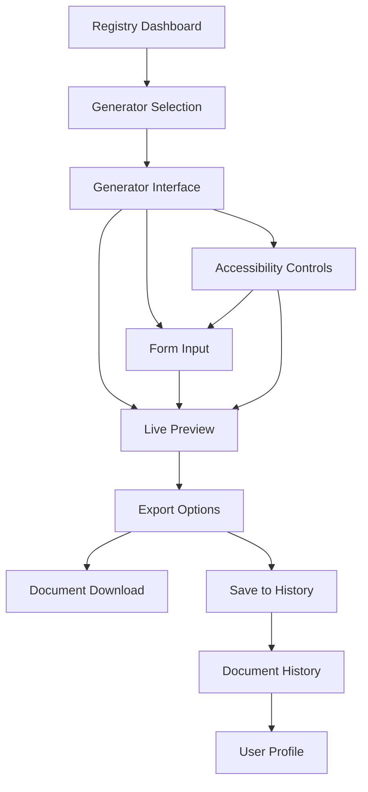

## 1. Product Overview

A comprehensive document generator platform that provides six specialized document creation tools with a unified, registry-driven interface. The system enables users to create professional documents through accessible forms with real-time validation, split-screen preview, and multiple export formats.

The platform solves the problem of scattered document creation tools by providing a centralized hub for generating business documents, technical specifications, reports, and creative content with consistent user experience and professional output quality.

## 2. Core Features

### 2.1 User Roles

| Role            | Registration Method      | Core Permissions                                              |
| --------------- | ------------------------ | ------------------------------------------------------------- |
| Guest User      | No registration required | Can access all generators, create documents with watermarks   |
| Registered User | Email registration       | Can save documents, export without watermarks, access history |
| Premium User    | Subscription upgrade     | Unlimited exports, advanced templates, priority support       |

### 2.2 Feature Module

The document generator platform consists of the following main pages:

1. **Registry Dashboard**: Document type selection, generator cards, search/filter functionality
2. **Generator Interface**: Split layout with form inputs and live preview, accessibility controls
3. **Document History**: Saved documents list, search, export history, version management
4. **User Profile**: Account settings, subscription management, export preferences

### 2.3 Page Details

| Page Name           | Module Name            | Feature description                                                                                 |
| ------------------- | ---------------------- | --------------------------------------------------------------------------------------------------- |
| Registry Dashboard  | Generator Cards        | Display six document generators as interactive cards with icons, descriptions, and usage statistics |
| Registry Dashboard  | Search & Filter        | Real-time search by document type, category filters, sorting options                                |
| Generator Interface | Split Layout           | Resizable panels with form inputs on left and live preview on right                                 |
| Generator Interface | Form Builder           | Dynamic form generation based on document schema with field validation                              |
| Generator Interface | Live Preview           | Real-time document rendering with syntax highlighting and formatting                                |
| Generator Interface | Accessibility Controls | Screen reader support, keyboard navigation, high contrast mode, font size adjustment                |
| Generator Interface | Export Options         | Multiple formats (PDF, DOCX, HTML, Markdown), quality settings, download/share                      |
| Document History    | Document List          | Grid/table view of saved documents with thumbnails, creation dates, and actions                     |
| Document History    | Search & Filter        | Search by title, filter by document type, date range, export status                                 |
| Document History    | Version Management     | Document versioning, compare versions, restore previous versions                                    |
| User Profile        | Account Settings       | Email, password, notification preferences, language settings                                        |
| User Profile        | Subscription           | Plan details, upgrade/downgrade, billing history, payment methods                                   |

## 3. Core Process

### Guest User Flow

1. User lands on Registry Dashboard and views available document generators
2. User selects a document type (Resume, Invoice, Contract, Report, Certificate, Letter)
3. User accesses Generator Interface with split layout showing form and preview
4. User fills out form fields with real-time validation feedback
5. User previews document in real-time with formatting applied
6. User exports document with watermark (guest limitation)
7. User can download or share the generated document

### Registered User Flow

1. User logs in and accesses Registry Dashboard with personalized recommendations
2. User can save work-in-progress documents to cloud storage
3. User generates documents without watermarks
4. User accesses Document History to manage saved documents
5. User can export multiple formats and access advanced settings
6. User manages profile and subscription through User Profile page

## 4. User Interface Design

### 4.1 Design Style

* **Primary Colors**: Professional blue (#2563eb), white background, gray accents (#6b7280)

* **Secondary Colors**: Success green (#10b981), warning amber (#f59e0b), error red (#ef4444)

* **Button Style**: Rounded corners (8px radius), subtle shadows, hover animations

* **Typography**: Inter font family, 16px base size, clear hierarchy with h1-h6

* **Layout**: Card-based design with consistent spacing (8px grid system)

* **Icons**: Heroicons for consistency, with proper alt text for accessibility

### 4.2 Page Design Overview

| Page Name           | Module Name     | UI Elements                                                                               |
| ------------------- | --------------- | ----------------------------------------------------------------------------------------- |
| Registry Dashboard  | Generator Cards | 2x3 grid layout on desktop, single column on mobile, card hover effects, usage badges     |
| Generator Interface | Split Layout    | 60/40 split on desktop, stacked on mobile, resizable divider with drag handle             |
| Generator Interface | Form Builder    | Clean form fields with labels above inputs, validation messages below, progress indicator |
| Generator Interface | Live Preview    | Syntax-highlighted code preview, formatted document view, zoom controls                   |
| Generator Interface | Export Options  | Dropdown menu with format icons, quality slider, file size estimation                     |
| Document History    | Document Grid   | Thumbnail previews, hover actions, selection checkboxes, bulk operations                  |
| User Profile        | Settings Panels | Tabbed interface, form validation, save indicators, confirmation dialogs                  |

### 4.3 Responsiveness

* **Desktop-first approach**: Optimized for 1920x1080 and 1366x768 resolutions

* **Mobile adaptation**: Responsive breakpoints at 768px and 480px

* **Touch interaction**: Larger tap targets on mobile (minimum 44px), swipe gestures for navigation

* **Progressive enhancement**: Core functionality works without JavaScript, enhanced experience with JS

### 4.4 Accessibility Features

* **WCAG 2.1 AA compliance**: Color contrast ratios, keyboard navigation, screen reader support

* **ARIA labels**: Proper labeling for all interactive elements

* **Focus management**: Visible focus indicators, logical tab order

* **Alternative inputs**: Voice recognition support, keyboard shortcuts for all actions

* **High contrast mode**: Toggle for users with visual impairments

* **Font scaling**: User-controlled font size adjustment (12px-24px

