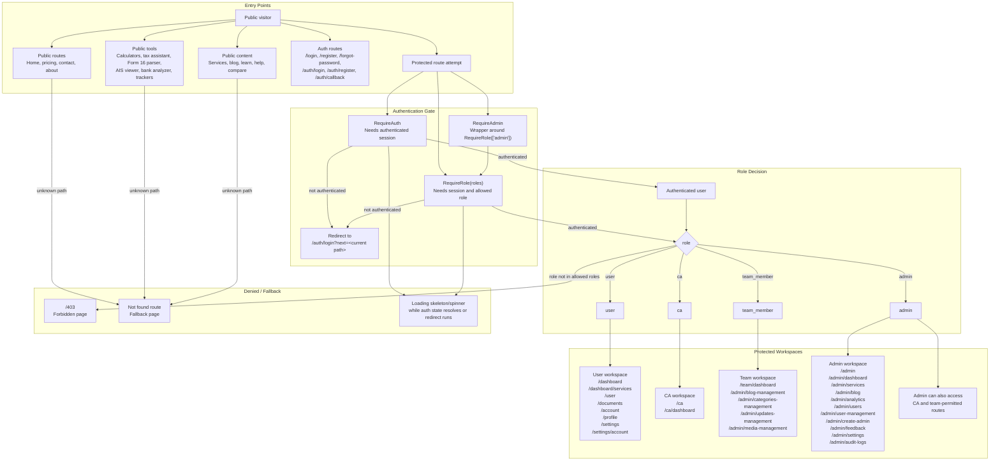

# User Role Flow Chart

This flow chart documents the current app-role routing and access behavior in the website. It focuses on the route guards in `client/src/Routes.tsx` and the authentication helpers used by protected pages.

## Current Implementation Notes

- `RequireAuth` redirects unauthenticated users to `/auth/login?next=<current path>`.
- `RequireRole` redirects unauthenticated users to `/auth/login?next=<current path>`, logs a `role_guard_denied` audit event for wrong-role access, and redirects wrong-role users to `/403`.
- `RequireAdmin` is an admin-only wrapper around `RequireRole(['admin'])`.
- `RoleBasedRedirect` exists and maps roles this way: `admin -> /admin/dashboard`, `team_member -> /admin/blog-management`, `ca -> /ca/dashboard`, default `user -> /dashboard`.
- `RoleBasedRedirect` is not currently mounted in `client/src/Routes.tsx`; protected route access is handled directly by route-level guards.
- `RequireAuth` and `RequireRole` write the intended destination as `next`, while `client/src/pages/auth/login.page.tsx` currently reads `redirect_url`. This is an observed routing mismatch in the current implementation.

## Source Cross-Check

- Route groups: `client/src/Routes.tsx`
- Authenticated guard: `client/src/components/auth/RequireAuth.tsx`
- Role guard: `client/src/components/auth/RequireRole.tsx`
- Admin guard: `client/src/components/auth/RequireAdmin.tsx`
- Role redirect helper: `client/src/components/RoleBasedRedirect.tsx`
- Login redirect parameter handling: `client/src/pages/auth/login.page.tsx`
